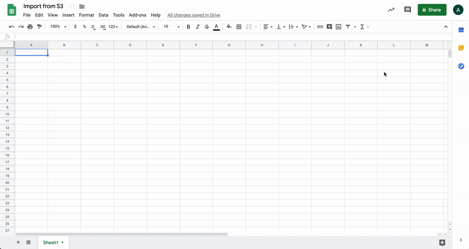

<p align="center">
  
</p>
<p align="center">A GAIA job to export S3 data to google sheet.</p>
<hr>
<p align="center">
 
<a href="https://app.intercom.io/a/apps/avw9yqcm/home"></a>

</p>

**Gaia Gsheet Export** aims to help users quickly export data from S3 to a spreadsheet. This functionality is available in Gaia as an executable job allowing to convine this one with any needed.

<p align="center">
     
</p>

## Table of Contents

* [Getting started](#getting-started)
  * [Dependencies](#dependencies)
  * [Configuration](#configuration)
* [Uses](#uses)
  * [Limitations](#limitations)

## Getting started
### Permissions
The step execution will be done from Gaia. To access to Gaia is necessary request the user register and the steps taht will be used. This request have to be done from...

### Gaia access
Once the user is registered, it could login to Gaia through http://gaia.ml.com/ where the step will be executed.
<p align="center">
     
</p>

### Gaia home screen
After login to Gaia the following screen will be shown.
<p align="center">
     
</p>

## Gaia configuration
Whit the selected steps is necessary to set up the parameters to execute the job.

### Common
Inside this section will be configured the job common parameters.
Name: Job name.
Group: The group refers to the folder where the job will be created. In case of having no group yet, is recommended to create one with the team name. There will be storaged all the jobs.
Commentaries: Any necessary commentary.
Sandbox: (?)

## Uses
<p>#Export information from S3 to Google sheet.</br>
#Google sheet apply format keeping the data type.</br>
#Create a pivot table.</p>

## Requirements
To execute the step a serie of parameters from the S3 bucket and the Google Sheet spreadsheet are required by GAIA.

### Spreadsheet parameters
Once the spreadsheet has been selected is necessary to set the following configuration to the correct Gaia step execution:
1. Share the spreadsheet with the following email address: <a>shipping-metrics@shipping-metrics.iam.gserviceaccount.com</a>.
2. Set "Can edit" in the sharing settings.
<p align="center">
     
</p>

Values required:
Spreadsheet ID
Sheet name
Kind of export:
  APPEND: Append the new values to the current sheet.
  OVERWRITE: Erase the sheet and write the imported values.

## Developers
#### Local run
```shell
$ fury get gaia-gsheet-export
```

## Limitations
800000 allow values it can be divided in as many rows as need.
